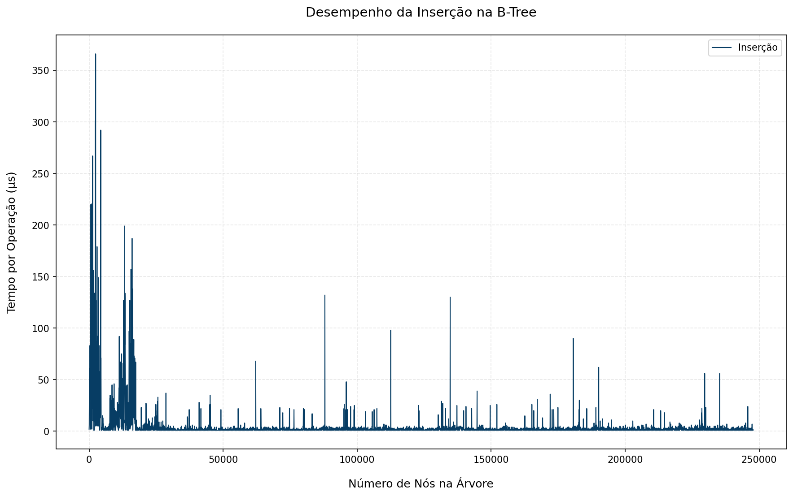
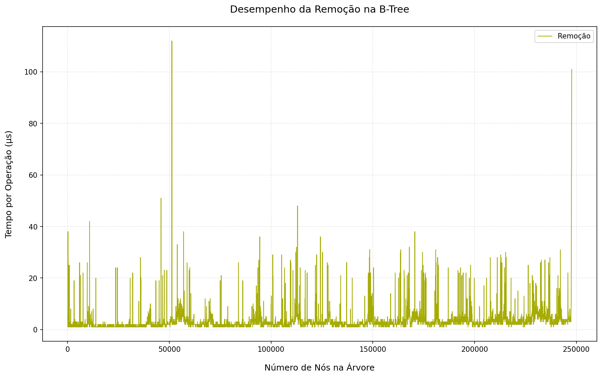
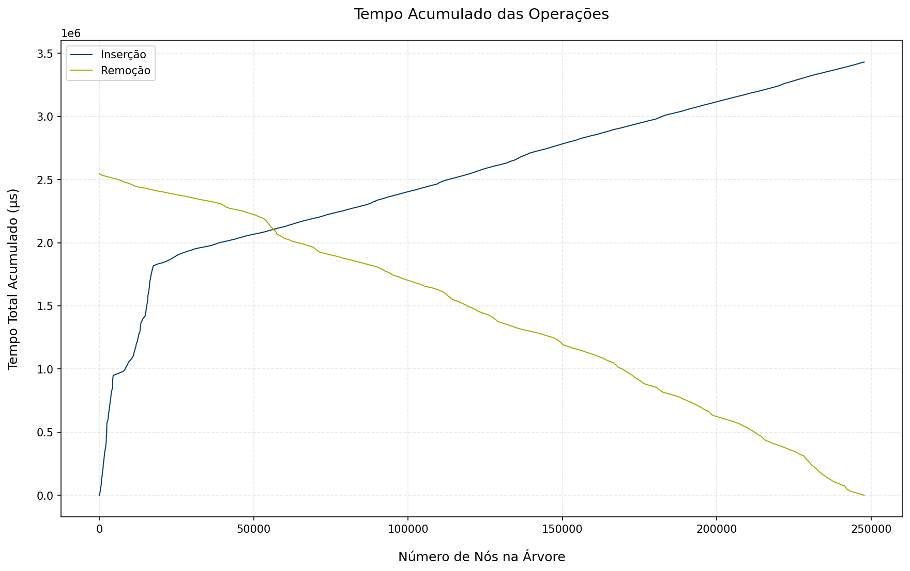

# Introdução

O objetivo é medir, para cada token lido do arquivo da Bíblia em formato txt, quanto tempo (em μs) leva para inserir e, depois, remover esse token da B-Tree, em diferentes estágios de crescimento da árvore. Os tempos são registrados em CSVs e plotados para análise de comportamento amortizado e variações pontuais (split, merge, rebalanceamento).

## Como Rodar

### 1. Compilar e Executar o Código em C

```bash
# Compilar
gcc btree.c -o btree

# Executar (gera insert_times.csv e delete_times.csv lendo 'blivre.txt')
./btree
```
### 2. Gerar Gráficos com Python

```bash
# Instale as dependências (pandas, matplotlib)
pip install pandas matplotlib

# Gerar todos os gráficos
python gerar_grafico.py
```
## Estrutura do Projeto

```bash
├── btree2.c # Implementação em C da B‑Tree e benchmark
├── blivre.txt # Arquivo de entrada (texto a ser indexado)
├── insert_times.csv # Saída: tempos de inserção (μs)
├── delete_times.csv # Saída: tempos de remoção (μs)
├── gerar_grafico.py # Python para gerar gráficos
├── desempenho_insercao.png # Gráfico: inserção vs. tamanho
├── desempenho_remocao.png # Gráfico: remoção vs. tamanho
├── comparacao_desempenho.png # Gráfico comparativo
└── tempo_acumulado.png # Gráfico de tempo total acumulado
```

## Pseudocódigo da B‑Tree (Ordem 3)

```text
CONST ORDER ← 3
MAX_KEYS ← 2·ORDER − 1
MIN_KEYS ← ORDER − 1

função CREATE_NODE(is_leaf):
    node.is_leaf ← is_leaf
    node.num_keys ← 0
    alocar node.keys[0…MAX_KEYS−1]
    alocar node.children[0…MAX_KEYS]

função SPLIT_CHILD(parent, i):
    y ← parent.children[i]
    z ← CREATE_NODE(y.is_leaf)
    // mover chaves e filhos
    para j de 0 até ORDER−2:
        z.keys[j] ← y.keys[j+ORDER]
    se não y.is_leaf:
        para j de 0 até ORDER−1:
            z.children[j] ← y.children[j+ORDER]
    y.num_keys ← ORDER−1

    inserir z como child de parent em posição i+1
    deslocar parent.keys e parent.children após i
    parent.keys[i] ← y.keys[ORDER−1]
    parent.num_keys++

função INSERT_NON_FULL(x, key):
    i ← x.num_keys−1
    se x.is_leaf:
        // inserir key em posição ordenada
        enquanto i ≥ 0 e key < x.keys[i]:
            x.keys[i+1] ← x.keys[i]
            i--
        x.keys[i+1] ← key
        x.num_keys++
    senão:
        while i ≥ 0 e key < x.keys[i]: i--
        i++
        se x.children[i].num_keys == MAX_KEYS:
            SPLIT_CHILD(x, i)
            se key > x.keys[i]: i++
        INSERT_NON_FULL(x.children[i], key)

função INSERT(tree, key):
    r ← tree.root
    se r.num_keys == MAX_KEYS:
        s ← CREATE_NODE(FALSE)
        s.children[0] ← r
        tree.root ← s
        SPLIT_CHILD(s, 0)
        INSERT_NON_FULL(s, key)
    senão:
        INSERT_NON_FULL(r, key)

função DELETE(tree, key):
    DELETE_KEY(tree.root, key)  // lógica completa em btree2.c
    se tree.root.num_keys == 0:
        ajustar raiz (merge ou novo nó vazio)
```

## Insights do Benchmark da B‑Tree (Ordem 3)

### Inserção  


Logo no início sentimos uma verdadeira montanha‑russa de latências (até **~360 μs**), enquanto a árvore sobe de 1→2→3 níveis e faz vários splits.  
Depois de **~200 000 tokens**, a profundidade estabiliza em **3–4 níveis**, e a maioria das inserções leva apenas **1–10 μs**.  
Os picos seguem um ritmo quase musical — a cada **~6 inserções** num mesmo ramo (ORDER=3), um split acontece. No fim, o **custo médio** permanece quase constante.

### Remoção 

O passeio aqui é mais suave: os maiores solavancos chegam a **~110 μs**, já que merges e redistribuições movem menos chaves que os splits.  
Quase todas as remoções custam **1–5 μs** quando o nó ainda tem chaves de sobra. Os merges só ocorrem ao cair abaixo de **2 chaves**, tornando‑se eventos raros e espaçados.  
Assim como na inserção, o **tempo médio por delete** é estável e previsível.

### Tempo Acumulado  


O gráfico de tempo acumulado revela como o custo total de inserir e depois remover cada token da Bíblia se comporta ao longo do benchmark.
- **Inserção (linha azul):** cresce quase linearmente até cerca de **3,4 s** (3 400 000 μs) ao inserir todos os ~247 000 tokens.  
- **Remoção (linha amarela):** decresce de forma simétrica (foi plotada “para baixo”), também somando perto de **3,4 s** ao esvaziar a árvore.  
Isso confirma que o trabalho total de inserir e depois excluir a mesma quantidade de dados está na mesma ordem de grandeza — as inserções acabam um pouco mais “caras” no agregado por causa dos splits mais custosos.

### Conclusão  
- A B‑Tree de **ordem 3** entrega **latências baixíssimas** na maior parte das operações (tipicamente < 10 μs), com picos estruturais bem visíveis.  
- O **custo amortizado** se mostra efetivamente **constante**, apesar de o pior‑caso ser O(log n).  
- Inserções são ligeiramente mais pesadas que remoções, mas, no total, ambos os processos demandam esforços similares.  

### Comportamento Amortizado  
Apesar de alguns picos pontuais de latência, o **custo médio por operação** mantém‑se praticamente **constante**:

- O pior‑caso teórico é **O(log n)**, mas, na prática, a B‑Tree “dilui” bem o esforço pesado.  
- À medida que a árvore cresce, os picos de manutenção (splits e merges) ficam mais espaçados — é preciso inserir ou remover muito mais chaves no mesmo ramo para dispará‑los novamente.

Esses resultados deixam claro por que a B‑Tree é tão eficiente para workloads de indexação e remoção em grandes volumes de dados sequenciais. 

Desenvolvido por Gabriel Peixoto 
